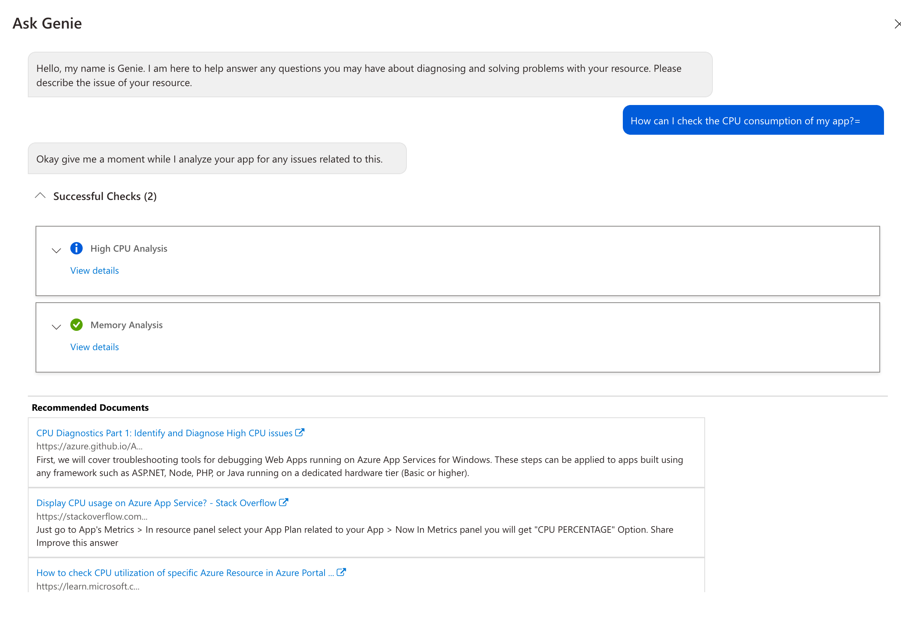
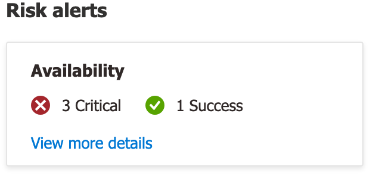
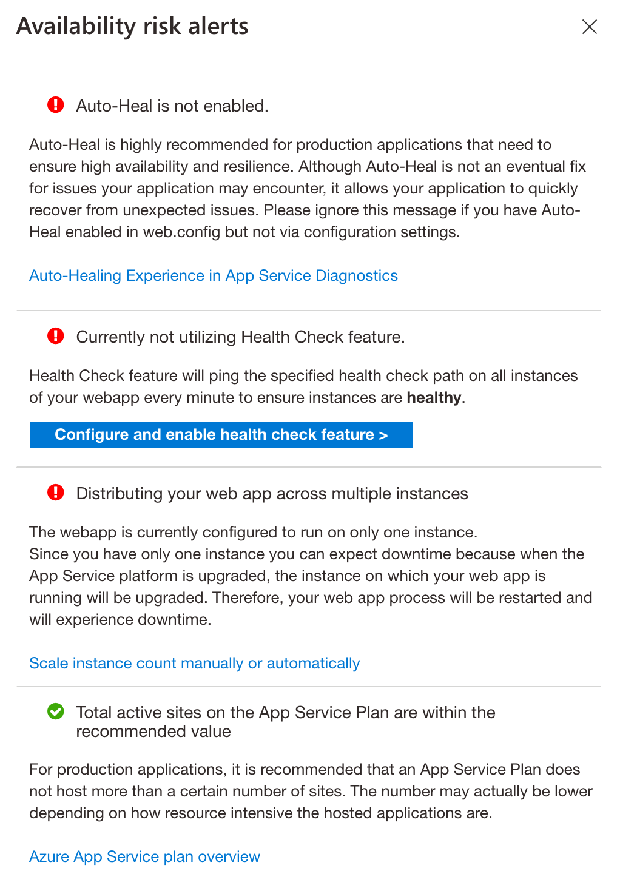

# Cloud Computing Gruppe 1

## Team

- Hade Mohamed
- Andreas Dreer
- Matiou Faltas
- Stephan Lanegger

# Deployment

Unter `doc/deployment.md` befindet sich eine Anleitung für das Deployment in Azure.

# Diagnostics

Azure Portal stellt Werkzeuge für die Diagnose von Problemen bereit siehe [Doku](https://learn.microsoft.com/en-us/azure/app-service/overview-diagnostics)

Das Diagnostic Interface bietet folgende Bereiche an:

1. Ask Genie
2. Risk Alerts
3. Troubleshooting categories
4. Popular troubleshooting tools

## Ask Genie

Ist ein Chat-basierter Bot, der grundlegende diagnostische Fragestellungen mittels aktuellen Fakten/Checks beantwortet bzgl. auch auf weiterführende Dokumente verweist:

## Risk Alerts

In diesem Bereich werden Check-Ergebnisse betreffend der Konfiguration der App angezeigt und Maßnahmen erläutert:

## Troubleshooting categories

Es gibt vier Kategorien für tiefgreifende Diagnosen:

- Availability and Performance
- Configuration and Management
- SSL and Domains
- Risk Assessments
- Navigator (Preview)
- Diagnostic Tools

Von hohem Interesse ist i. d. R. die Verfügbarkeit und Lasteffizienz der App. Für weitere Vertiefung wird an dieser Stelle auf die [Microsoft-Doku](https://learn.microsoft.com/en-us/azure/app-service/overview-diagnostics) verwiesen.

### Availability and Performance

Für die Überprüfung der Verfügbarkeit und Lasteffizienz stehen verschiedene Tools zur Verfügung, die folgendes ermöglichen:

- Identifikation von Downtime der App
- Identifikation von Latenzproblemen der App
- Analyse der CPU- oder Speicher-Nutzung
- Analyse ausgehender TCP-Verbindungen der App
- Analyse der HTTP 4xx Fehler
- Health-Checks
- u.v.m.
